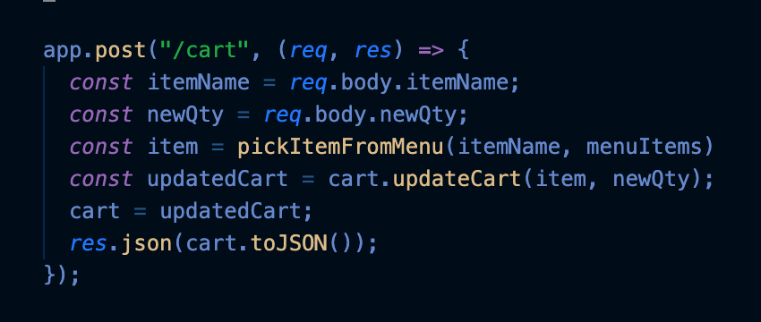
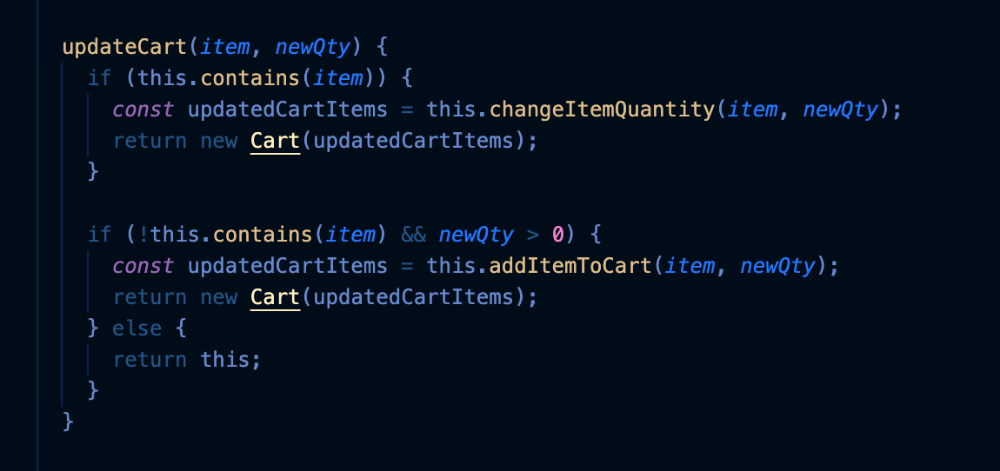

Writing stupid endpoints was a lesson I learned in making Seaside Cafe. My mentor told me to keep the endpoints idiot proof. All the endpoint has to be concerned with was receiving the request and sending a response back. The logic of how it handles the request should be delegated elsewhere.

In Seaside Cafe, I had the endpoint for POST requests to “/cart” receive information from the client and use that information to update the cart. The logic of updating the cart was handled elsewhere. All the endpoint has to worry about is sending the updated cart information to the client.

Server endpoint for POST request to "/cart"

Method with logic of updating the cart
