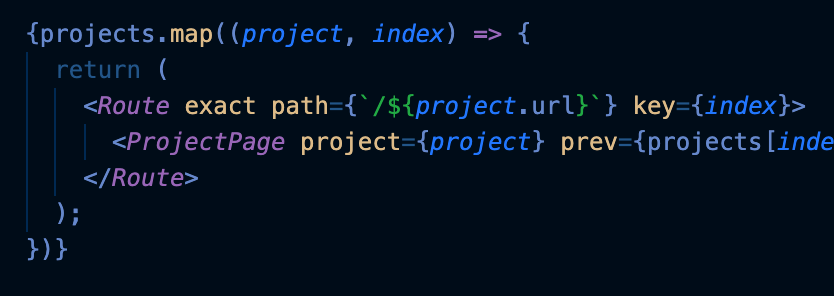
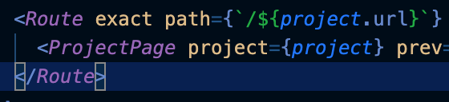
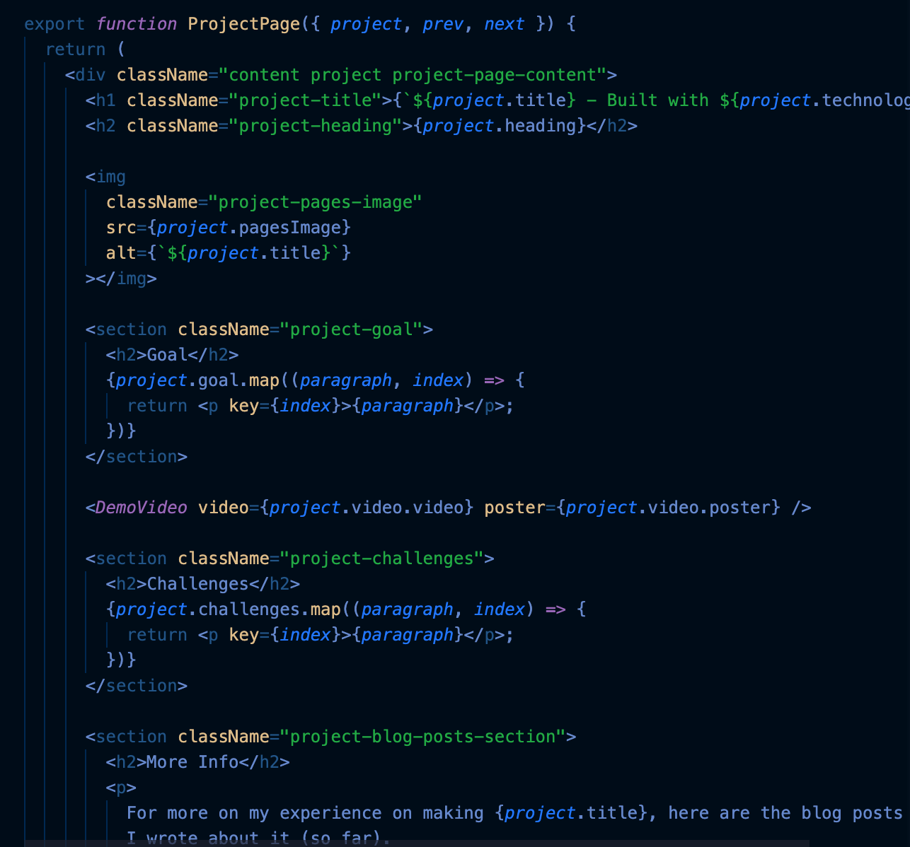
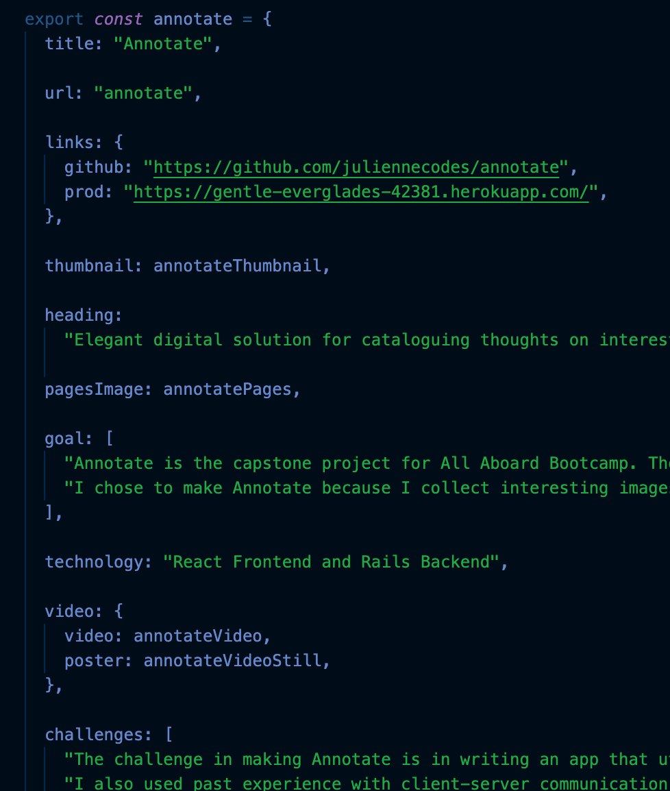

I just finished making my [web development portfolio](https://juliennecodes.github.io). It features the projects I made and blog posts I’ve written. In the process of making the site, I weighed my options. Do I spend the time writing hardcoded information for each project or do I invest time into learning how to dynamically create pages?

The answer was both! 

I did hardcode information at the start just to publish it quickly. However, I found that process to be a bit tedious, which was why I turned to figuring out how to do dynamic pages.

The biggest challenge I think was dynamically creating routes. I knew it was possible from a vague memory of a video I watched many months ago but I couldn't exactly recall how. I can create components from objects but how do I create the routes to several different projects?

Here’s how.

I had a projects array that contained several projects. 

When I mapped through the projects array, I dynamically created route paths using the URL property from each project.

This made it so that there is now a Route component watching out for browser URL matches to */annotate*, */pomodoro*, and */seaside-cafe*.

In the event that the Route path matches the URL in the browser, the Route component’s children are rendered. 

If the current URL in the browser is */annotate*, a ProjectPage component, configured to the annotate project, is rendered.

The ProjectPage component is a template for the project pages. It gets customized with specific information from each project. I passed in the project object to the ProjectPage component so that I can extract information like so.

I think spending time learning how to do dynamic pages was a good decision. With hardcoding information, the time required just grows more and more with each new project. Although there is a greater initial investment in time with learning how to do dynamic pages, there is less time involved in writing pages for future projects since I just have to assemble the object that represents that project and I don’t have to bother with marking up the content.

The downside of this is I am limited to the template version. I have to adhere to the already provided structure. I think the time saved in having a template is a good tradeoff though so all is well and good.