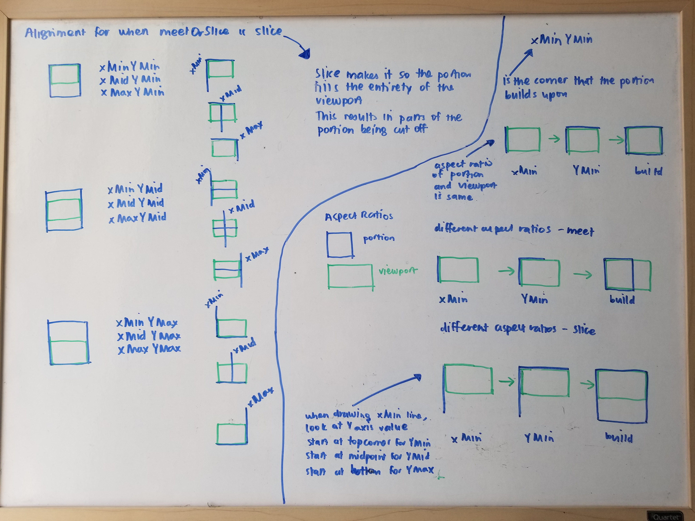

I read up more about preserveAspectRatio and I think I understand it now.

Here are my whiteboard notes

## New Concepts
- preserveAspectRatio
- meet
- slice
- alignment

### preserveAspectRatio
preserveAspectRatio is really pertinent when the aspect ratio of the portion of the infinite canvas does not match the aspect ratio of the viewport.

You have to decide does the portion get contained in the viewport with all of the portion content showing or does the portion fill up the viewport with only parts of it showing?

Examples
- preserveAspectRatio = "xMaxYMin meet"
- preserveAspectRatio = "xMidYMax slice"

### Meet
Meet is the portion being contained

### Slice
Slice is the portion filling up the viewport

### Alignment
Alignment is how the portion is positioned in the viewport. xMinYMin makes it so xMin of the portion is aligned to the xMin of the viewport. It also means YMin of the portion is aligned to the YMin of the viewport.

I went through the values in my whiteboard notes.

I also updated my [explore-svg project](https://juliennecodes.github.io/explore-svg) where I experimented with different svg element alignments.