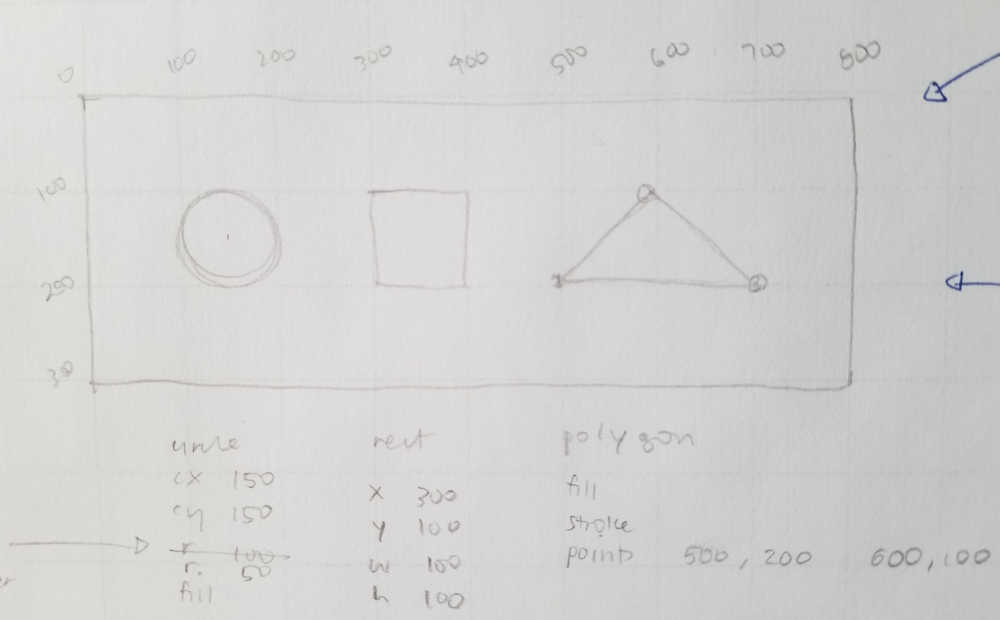
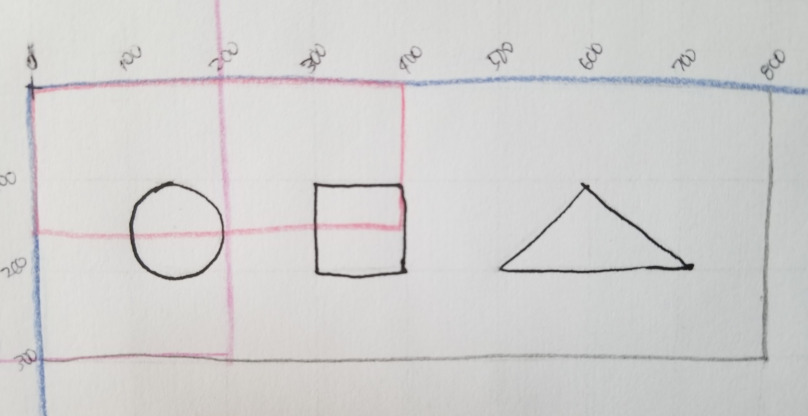
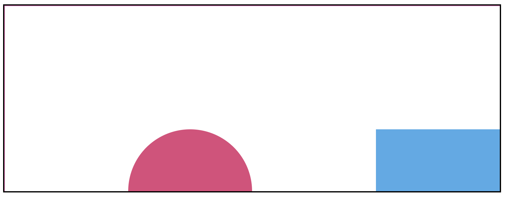

For the longest time, I couldn’t really understand how SVG worked. I read about the subject from many different sources but nothing really explained viewBox and viewport to me in a way that I understood. Luckily, I found [Sara Soueidan’s blog post](https://www.sarasoueidan.com/blog/svg-coordinate-systems) on it, which illuminated a lot of things.

I think what was missing from my previous understanding of SVG is the concept of infinite canvas and the portion of the canvas, decided by the viewBox, gets mapped to the viewport. Once I understood those two concepts, a lot of things fell into place.

So here is a very simple explanation.

So, you have your infinite canvas, upon which you can draw many shapes. It has its own coordinate system. You draw your shapes using that coordinate system, like `<circle cx="150" cy="150" r="50" fill="hsl(341, 58%, 57%)" />`, which has its center on (150, 150) and its radius is 50 units.

Then you decide on a viewBox. The viewBox decides which portions of the canvas you want to map to the viewport. In simpler terms, you decide which portion of the canvas goes on the viewport.

In this picture, the horizontal pink viewBox only shows the area from (0, 0) to (400, 150). It is decided that only that portion of the canvas gets to fill the viewport. Therefore, only parts of the circle and the square will be shown. The triangle is off the screen altogether.

This is what it looks like in the viewport

I documented my experiments in my [explore-svg project](https://juliennecodes.github.io/explore-svg).

However, I did hit a snag when the aspect ratio of the viewBox does not match the aspect ratio of the viewport. I thought I understood what would happen and had a predictive picture of what it should look like. My educated guess was wrong so I will be reading more on the subject.

**So summary**
- Draw your shapes in a graph paper, this is your infinite svg canvas
- Decide which portion of the canvas you want shown in the viewport
- The viewBox values decide on which portion of the canvas is shown in the viewport

