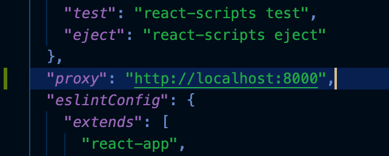
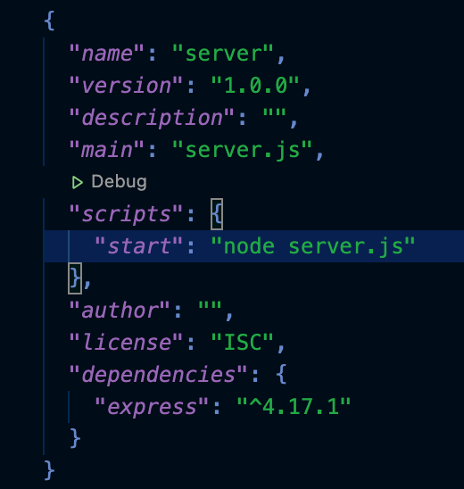
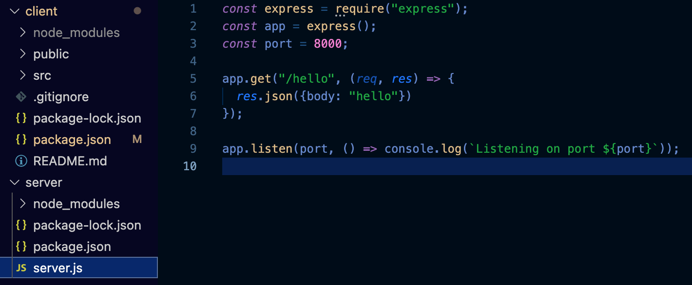

This is a guide for setting up a React frontend and Express backend app.

## Set up React frontend
1. Create React app
    - In the terminal, go to your project directory
    - Type command - npx create-react-app client

1. Set up proxy for local development
    - After the React app is created, open package.json
    - Add proxy property and give it the value of - http://localhost:8000

That’s it for the frontend!

## Set up Express backend
1. Create a server folder in your project folder

1. Create package.json
    - In the terminal, go to your project folder/server directory
    - Type command - npm init
    - Press enter for every choice except for entry point, type - server.js - instead
    - Optional
        - Edit package.json
        - For the scripts object, add “start”: “node server.js”
    - This is what package.json in the express server looks like

3. Install Express as a dependency
    - In the terminal, go to your project folder/server directory
    - Type command - npm install express --save

1. Create server.js
    - Open your project in your code editor
    - Create a new file server.js in project > server folder
    - Write this code in the server file
        `const express = require("express");
        const app = express();
        const port = 8000;
        app.get("/hello", (req, res) => {
          res.json({body: "hello"})
        });
        app.listen(port, () => console.log("Listening on port 8000"));`

    - Important note - Express port is 8000. This makes it so both the client and the server can run at the same time without conflict. React runs on port 3000 and Express run on port 8000.

## Notes
- Starting React App
  - In the terminal, go to your project/client directory
  - Type command - npm start

- Starting Express Server
  - In the terminal, go to your project/server directory
  - Type command - node server.js

- Testing React and Express Connection
  - Start your React app
  - Type this code in the console

`fetch("/hello").then(res => res.json()).then(serverResponse => console.log(serverResponse.body));` 

### P.S Notes
- In development, the endpoint “/” doesn’t work in Express server. When a GET request is made to that endpoint, the React app supersedes the proxy and the GET request gets the index.html of the React app instead.

- When you make changes to the server code, you have to close the current server and run it again.
