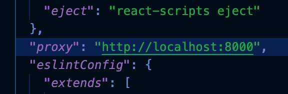
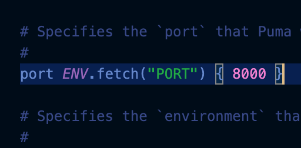
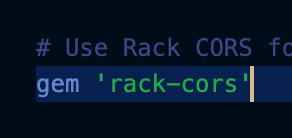
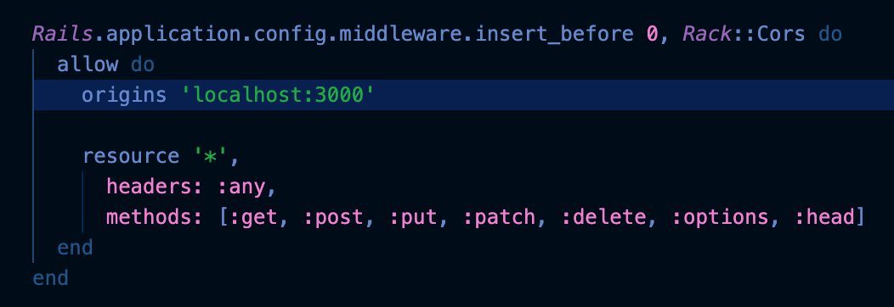

This is a guide for setting up a React frontend and Rails backend app.

## Set up React frontend
1. Create React app
	- In the terminal, go to your project directory
	- Type command - npx create-react-app client

1. Set up proxy for local development
	- After the React app is created, open package.json
	- Add proxy property and give it the value of - http://localhost:8000

That’s it for the frontend!

## Set up Rails backend
1. Set up REST API Rails backend
	- In the terminal, go to your project directory
	- Type command - rails new server --api -T

1. Set up puma.rb
	- Open project in your code editor
	- Open puma.rb
		- server > config > puma.rb
	- Change the port that the server is listening to for requests from 3000 to 8000

3. Set up Gemfile
	- Open project in your code editor
	- Open Gemfile
		- server > Gemfile
	- Add gem ‘rack cors’
	
	- In the terminal, go to project folder/server directory
	- Type command - bundle install

1. Set up cors.rb
	- Open project in your code editor
	- Open cors.rb
		- server > config > initializers > cors.rb
	- Add Rack::Cors code block
	- Change origins to ‘localhost:3000’

## Notes
- Starting React App
  - In the terminal, go to your project/client directory
  - Type command - npm start

- Starting Rails Server
  - In the terminal, go to your project/server directory
  - Type command - rails s

- React app will run on port 3000 and requests will be proxied to port 8000. 
- Rails server will run on port 8000 and accept requests coming from port 3000.